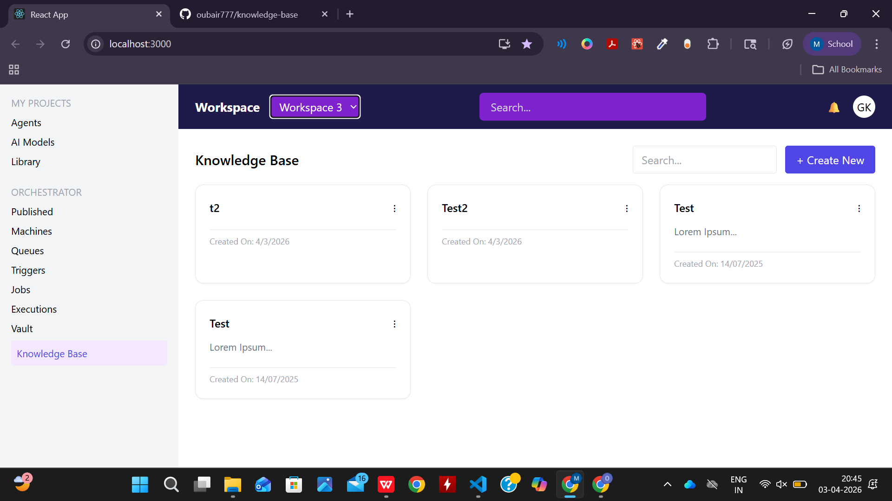
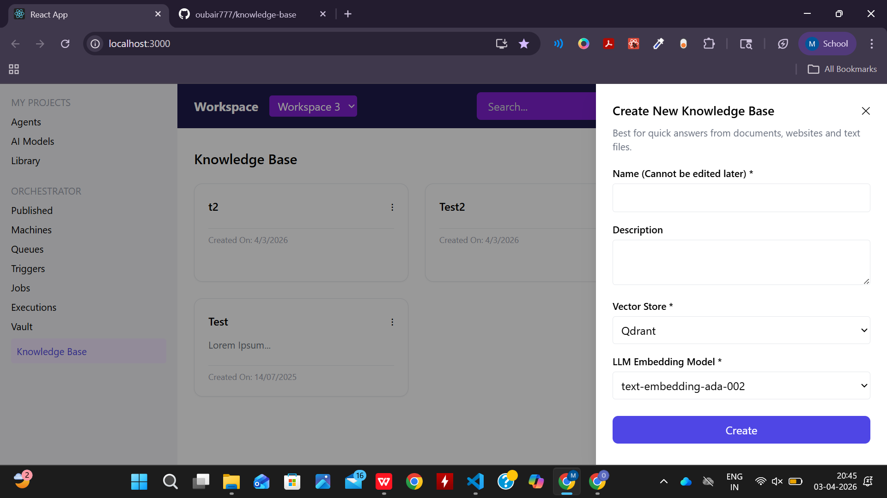

# Knowledge Base UI (React + Tailwind)

#  Overview
This project is a pixel-accurate implementation of a Knowledge Base dashboard UI built using React and Tailwind CSS. It replicates the provided Figma design with focus on clean UI, reusable components, and basic interactivity.

#  Features
- Responsive dashboard layout
- Sidebar navigation
- Header with search bar
- Knowledge Base cards grid
- Create New Knowledge Base drawer
- Add new cards dynamically
- Search functionality to filter cards

# Tech Stack
- React (Functional Components + Hooks)
- Tailwind CSS

#  Component Structure
- Header
- Sidebar
- Card
- Drawer (Create New Modal)
- Home Page

#  Functionality Implemented
- Add new Knowledge Base item using Drawer form
- Dynamic rendering of cards
- Search filter for cards (by name)
- Drawer open/close interaction

#  Objective
To demonstrate the ability to convert Figma design into a scalable React UI with clean architecture and basic state management.

## 📸 Screenshots

